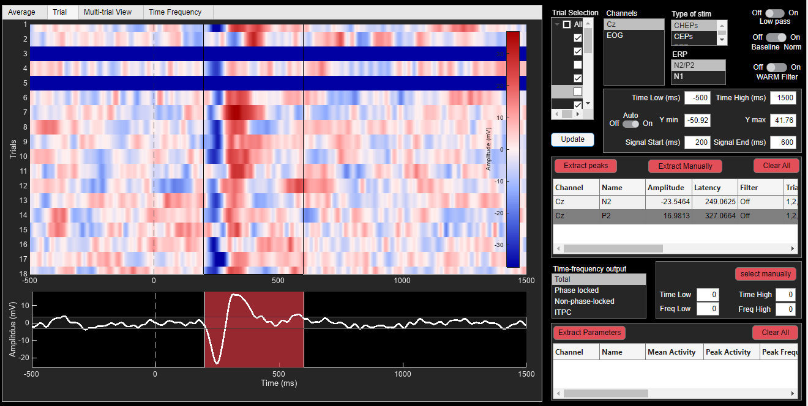
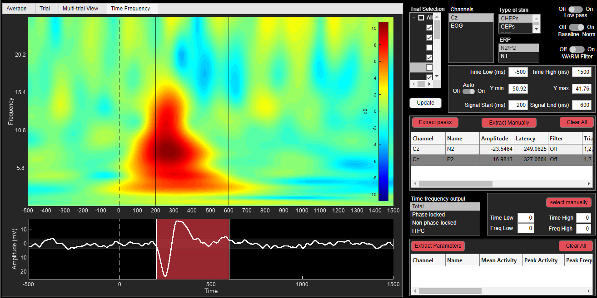
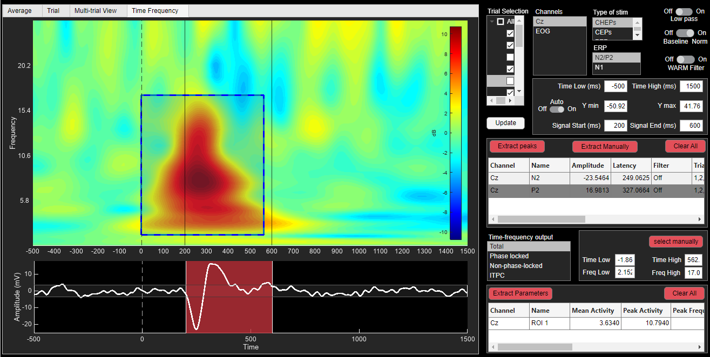
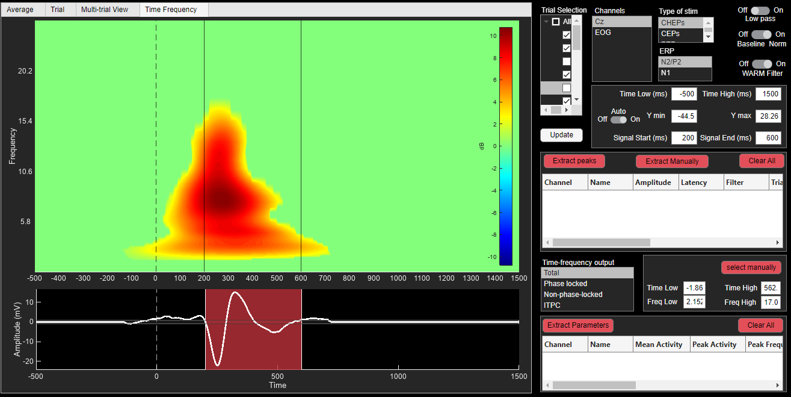
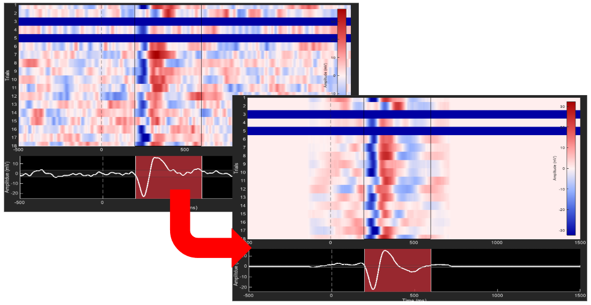

# EEG Brain Visualization & Processing Tool 🧠

A MATLAB-based application for standardized, interactive EEG signal processing and visualization — designed to support advanced analyses like time-frequency decomposition, single-trial exploration, and peak extraction **without requiring any coding experience**.

---

## Purpose

This tool empowers researchers, clinicians, and students to perform high-level EEG data cleaning, transformation, and analysis through an intuitive GUI. It bridges the gap between raw signals and publishable figures by making complex processing steps transparent and accessible.

---

## Key Features

**Live Channel Cleaning**  
– Exclusion of noisy or faulty channels.


**Dynamic Epoch Management**  
– Update and visualize epochs instantly after filtering or artifact rejection.


**Time-Frequency Decomposition**  
– Generate spectrograms or ERSP maps with Morlet wavelets.


**Peak Detection and Extraction of Power metrics for Sensory Protocols**  
– Automatic extraction of peaks from standard tests like:
- CHEPS (Contact Heat Evoked Potentials)
- LEPs (Laser Evoked Potentials)
- SEPs (Somatosensory Evoked Potentials)


**Statistical Filtering**  
– Apply non-parametric tests, cluster-based corrections, or significance thresholds to results.



**Data Export**  
– Extract and save cleaned data, peak tables, and time-frequency matrices for downstream use (e.g., R, Python, SPSS).

---

## Requirements

- **MATLAB R2021a+**  
- Toolboxes: Signal Processing, Statistics and Machine Learning, EEGLAB (recommended)

Optional:
- FieldTrip, Brainstorm, or other EEG plugin integrations

---

## Getting Started

1. **Clone the Repository**

```bash
git clone https://github.com/ortizo-117/EEG-Brain-Visualization-Tool.git
```

2. **Launch in MATLAB**

Open `main_app.mlapp` in MATLAB’s App Designer or run:

```matlab
run('launch_tool.m')
```

3. **Load Your Data**

Supported formats:
- `.set` (EEGLAB)
- `.edf`, `.bdf`
- Preprocessed `.mat` files (see templates)

4. **Explore EEG Processing Modules**

Each tab/module offers:
- User-guided preprocessing
- Instant visualization
- Guided export options


## Ideal For

- Neuroscience researchers needing consistent preprocessing pipelines  
- Labs analyzing evoked potentials (CHEPS, LEPs, SEPs)  
- Students new to EEG or MATLAB-based signal analysis  
- Clinicians exploring biomarkers or latency-based metrics  

---

## Modules Overview

| Module                   | Description                                         |
|--------------------------|-----------------------------------------------------|
| **Channel Cleaning**     | Visual thresholding, interpolation, channel rejection |
| **Epoching**             | Time-locking events, baseline correction            |
| **Time-Frequency**       | Morlet or FFT-based spectral analysis               |
| **Peak Extraction**      | Automatic latency/amplitude detection                |
| **Statistics**           | Within/between-subject significance analysis        |
| **Export Tools**         | Cleaned signals, tables, TF data                     |

---

## Development & Testing

To modify or contribute:

```bash
git checkout -b feature/your-feature
```

Please follow MATLAB best practices and submit pull requests with clear commit messages.

---

## License

Distributed under the **MIT License**.  
See [LICENSE](LICENSE) for more information.

---

## Contact

Created by **Ortizo**  
📧 Reach out at [oscar.ortiz.angulo@gmail.com]

---

> “Make EEG analysis accessible, consistent, and code-free.”
