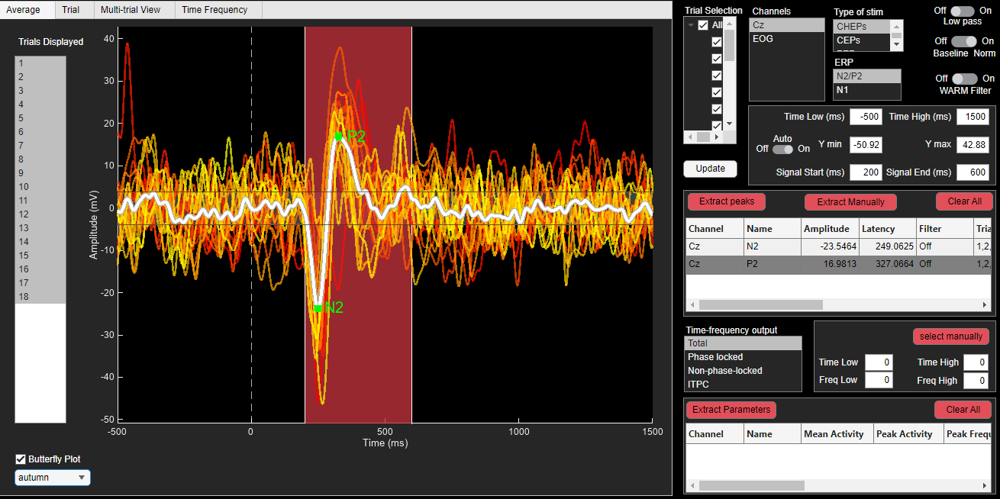
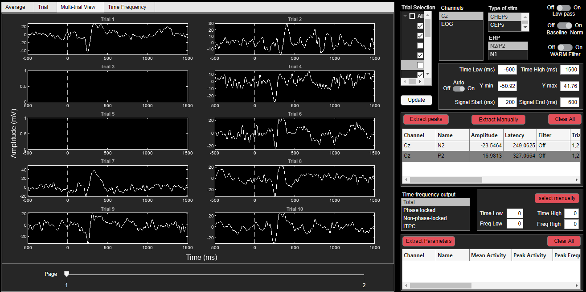
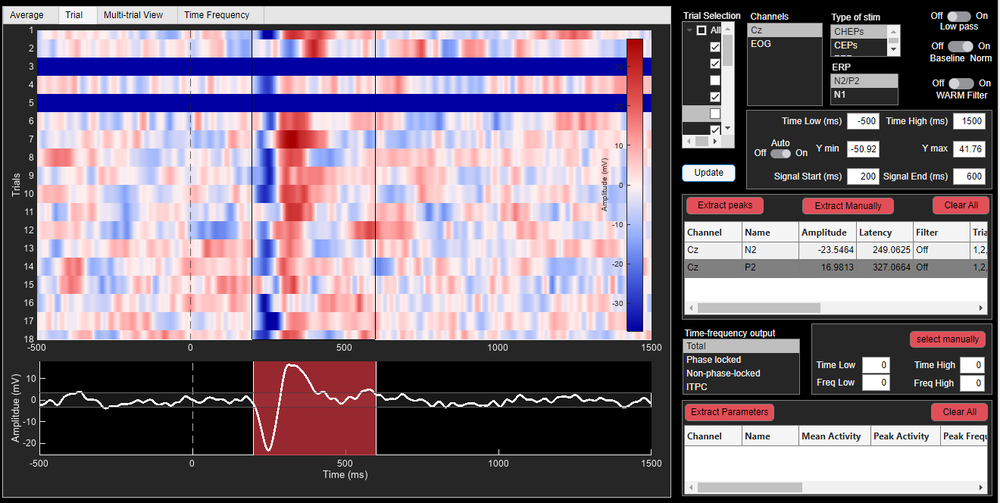
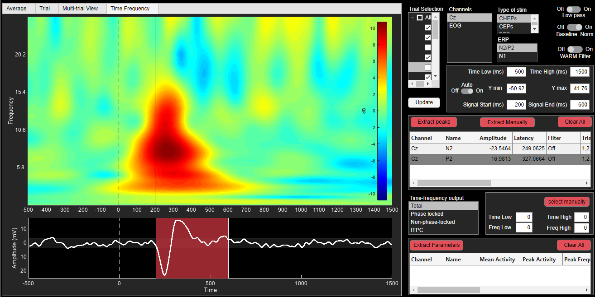
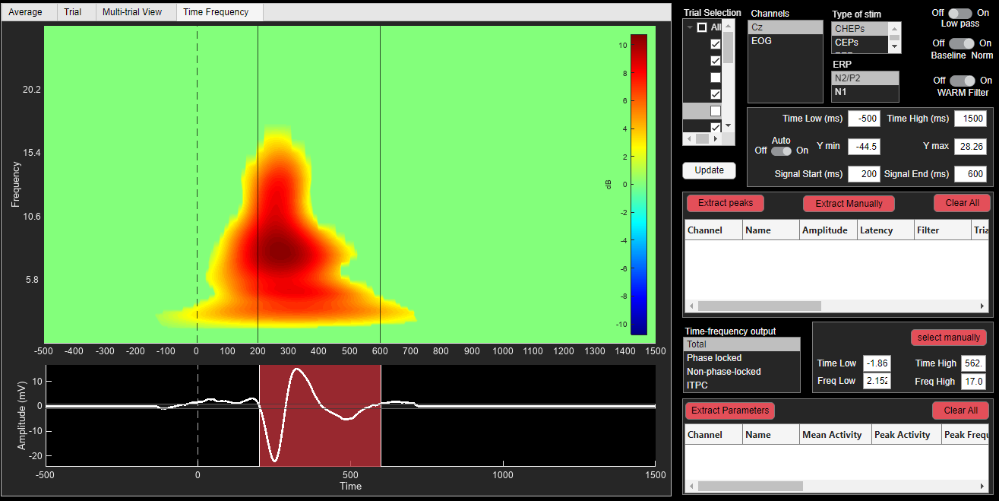
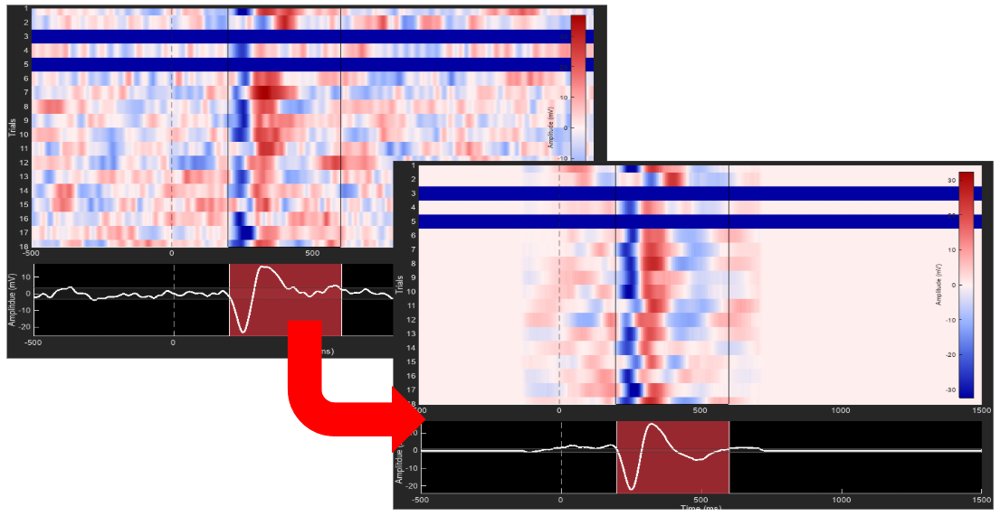
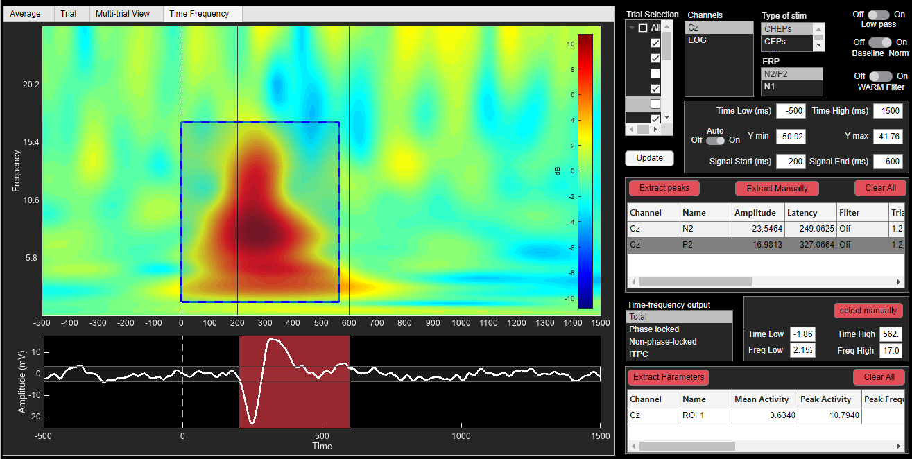

# EEG Brain Visualization & Processing Tool

A MATLAB-based graphical application for visualizing, processing, and analyzing EEG data.

This tool provides an interactive interface for reviewing EEG channels, inspecting epochs and trials, generating time-frequency visualizations, extracting signal metrics, and exporting processed results for further analysis.



---

## Overview

The **EEG Brain Visualization & Processing Tool** is designed to make EEG data exploration easier and more visual. Instead of writing custom MATLAB scripts for every step of analysis, users can interact with EEG data through a graphical user interface built with MATLAB App Designer.

The application is intended for EEG research workflows involving signal inspection, channel review, trial-level visualization, time-frequency analysis, filtering, and peak or feature extraction.

---

## Features

### Interactive EEG Visualization

- View EEG signals through a MATLAB-based GUI
- Inspect channels, trials, and epochs
- Explore EEG responses visually
- Review single-trial and averaged signal activity

### Channel and Data Review

- Inspect channel-level EEG activity
- Identify noisy or problematic signals
- Support cleaner preprocessing before analysis
- Load supporting EEG-related `.mat` files

### Epoch and Trial Inspection

- Visualize EEG activity across trials
- Review single-trial traces
- Display trial-level heatmaps
- Compare signal patterns across epochs or conditions





### Time-Frequency Analysis

- Generate time-frequency decompositions
- Visualize changes in signal power over time
- Explore spectral activity across trials or conditions
- Support event-related EEG analysis workflows



### Filtering and Effect Visualization

- Apply visual or statistical filtering workflows
- Highlight meaningful EEG effects
- Compare filtered and unfiltered signal patterns





### Metric Extraction and Export

- Extract EEG-related metrics such as peaks, latencies, or amplitudes
- Export processed results for downstream analysis
- Save outputs for use in MATLAB, Python, R, SPSS, or other tools

---

## Repository Contents

| File | Description |
|---|---|
| `brain_vis_tool_2.mlapp` | MATLAB App Designer application file |
| `brainviz_app_V2.mlapp` | MATLAB App Designer application file |
| `EEG_struct_copy.mat` | Example or supporting EEG data structure |
| `chan_info.mat` | Channel information file |
| `new_color_map_2.mat` | Custom colormap data |
| `main_interface.PNG` | Screenshot of the main app interface |
| `single_trial_traces.PNG` | Single-trial trace visualization |
| `single_trial_heat_plot.PNG` | Single-trial heatmap visualization |
| `tf_decomposition.PNG` | Time-frequency analysis screenshot |
| `warm_filter.PNG` | Filtering visualization |
| `warm_filter_effect.PNG` | Filter effect visualization |
| `selecting_roi.PNG` | Region of interest selection screenshot |

---

## Requirements

Recommended environment:

- MATLAB R2021a or newer
- MATLAB App Designer
- Signal Processing Toolbox
- Statistics and Machine Learning Toolbox

Optional but useful:

- EEGLAB
- FieldTrip
- Brainstorm

Some analysis functions may require additional MATLAB toolboxes depending on the workflow being used.

---

## Getting Started

### 1. Clone the repository

```bash
git clone https://github.com/ortizo-117/EEG-Brain-Visualization-Tool.git
cd EEG-Brain-Visualization-Tool
```

### 2. Open the application in MATLAB

Open one of the included MATLAB App Designer files:

```matlab
open("brain_vis_tool_2.mlapp")
```

or

```matlab
open("brainviz_app_V2.mlapp")
```

You can also open the app manually by double-clicking the `.mlapp` file from the MATLAB Current Folder panel.

### 3. Load EEG data

Use the app interface to load EEG data and supporting `.mat` files.

Example support files included in this repository:

```text
EEG_struct_copy.mat
chan_info.mat
new_color_map_2.mat
```

### 4. Begin analysis

Use the app controls to inspect channels, review trials, generate visualizations, run time-frequency analysis, apply filters, extract metrics, and export results.

---

## Example Workflow

A typical workflow may include:

1. Load EEG data into the application.
2. Inspect EEG channels and identify noisy signals.
3. Review trials or epochs.
4. Generate single-trial visualizations.
5. Run time-frequency decomposition.
6. Apply filtering or statistical thresholds.
7. Extract EEG metrics such as peaks or latencies.
8. Export processed data and results.

---

## Screenshots

### Main Interface


### Region of Interest Selection



### Time-Frequency Decomposition


### Single-Trial Traces


### Single-Trial Heatmap


### Filtering Visualization


### Filter Effect Visualization


---

## Intended Users

This tool is useful for:

- Neuroscience researchers working with EEG data
- Students learning EEG signal processing
- Clinical research teams analyzing evoked potentials
- Labs that need a visual workflow for EEG review
- MATLAB users who prefer GUI-based analysis tools

---

## Development

To modify the application:

1. Open the `.mlapp` file in MATLAB App Designer.
2. Edit the interface, layout, or callback functions.
3. Test the app with EEG data.
4. Save the updated app file.
5. Commit and push your changes.

Example:

```bash
git checkout -b feature/new-analysis-module
git add .
git commit -m "Add new EEG analysis module"
git push origin feature/new-analysis-module
```

---

## Notes

- This tool is intended for research and educational use.
- Results should be validated before being used in publications or clinical settings.
- Input data format requirements may vary depending on the analysis module.
- Large EEG datasets may require additional memory or processing time in MATLAB.

---

## Roadmap

Potential future improvements:

- Add a packaged MATLAB app installer
- Include a step-by-step demo dataset
- Add documentation for expected EEG data structures
- Add automated tests for processing functions
- Improve error handling for unsupported file formats
- Add more export options
- Add a license file

---

## Author

Created by **Oscar Ortiz Angulo**

Email: oscar.ortiz.angulo@gmail.com

---

## Citation

If you use this tool in academic or research work, please cite the repository:

```text
Ortiz Angulo, O. EEG Brain Visualization & Processing Tool. GitHub repository:
https://github.com/ortizo-117/EEG-Brain-Visualization-Tool
```
---

> “Make EEG analysis accessible, consistent, and code-free.”
